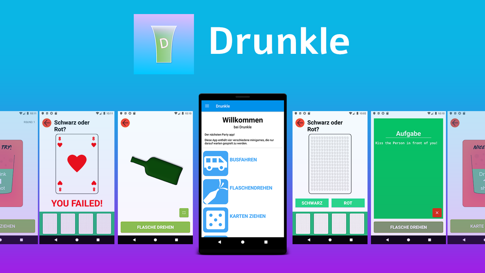

# Drunkle_Public
 Dieses Projekt handelt sich um eine reine Android Applikation. Diese wurde mit Android Studio und Java entwickelt.
<h2>Download & Install</h2>
Die Applikation kann direkt über den <b><a href="https://play.google.com/store/apps/details?id=com.drinringmirkocordes.drinke2">Google Play Store</a></b>  oder durch die release.apk im <b><a href="Installs/">Installs</a></b> Ordner installiert werden.

<h2>Bilder</h2>
Auch stehen ihnen Voschaubilder zur Verfügung. Diese finden sie im Ordner <b><a href="Gallery/">Gallery</a></b>.

